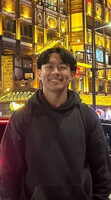
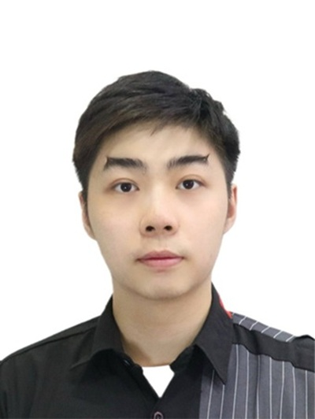
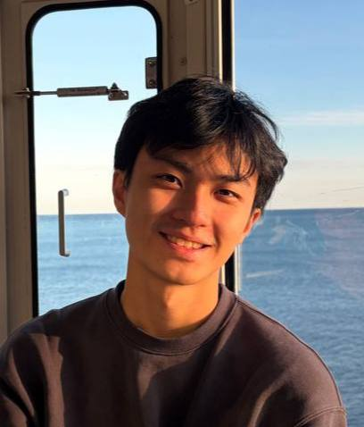

We are a team based in the [School of Computing, National University of Singapore](https://www.comp.nus.edu.sg).

You can reach us at the email `seer[at]comp.nus.edu.sg`

## Project team

### Khang Sian

[[homepage](http://www.comp.nus.edu.sg/~damithch)]
[[github](https://github.com/khangsian0412)]
[[portfolio](team/johndoe.md)]

* Role: Project Advisor

### Anders Chow

[[github](http://github.com/anderschow)]

### Zhou XinYu

[[github](http://github.com/xinyu-zxy)]

* Role: Team Lead
* Responsibilities: UI

### Lee Hayoung

[[github](http://github.com/0218hy)] [[portfolio](team/johndoe.md)]

* Role: Developer
* Responsibilities: Data

### Chung Hean

[[github](http://github.com/chunghean)]
[[portfolio](team/johndoe.md)]

* Role: Developer
* Responsibilities: UI
